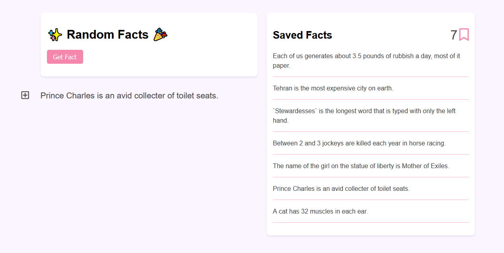

# FunFacts-fetch-Api  
Using fetch( )  to get 🎉 fun facts ✨ from a [public api](https://uselessfacts.jsph.pl/) 🎈

## TODO

✔ Fetch facts  
✔ Save facts to localStorage  
⬛ Delete specific facts  
⬛ Delete all facts (Clear)  
⬛ Mobile view  

## Demo  

Live demo hosted on netlify

## License

- **[MIT license](LICENSE)**
- Copyright 2020 © <a href="https://aymkh.tn/" target="_blank">AymKh</a>.
